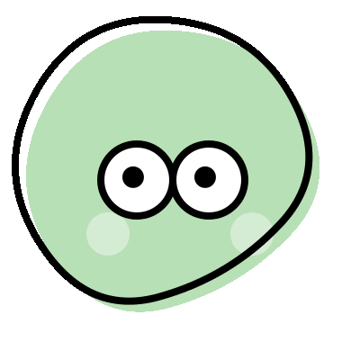
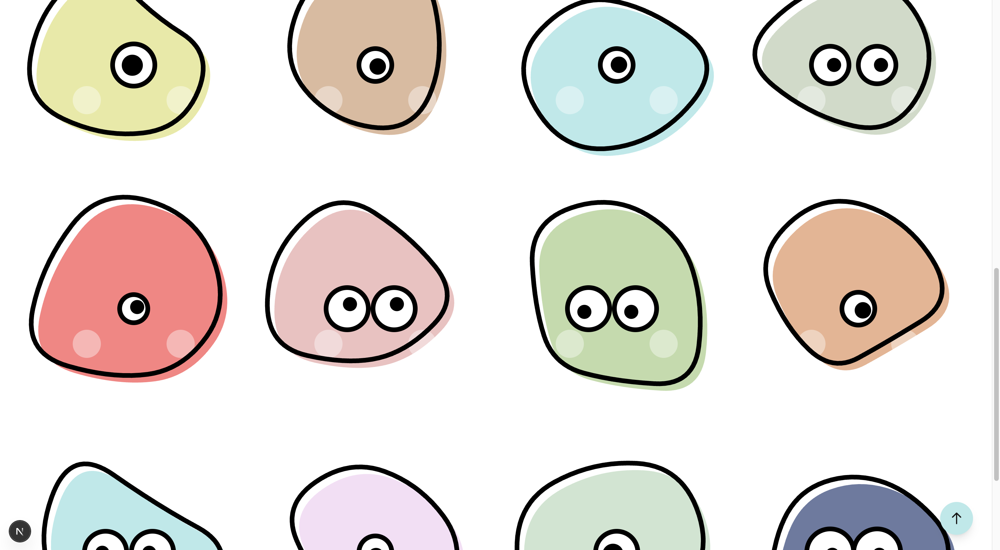

## Blobby

<h1 align="center"> <br />Blobby</h1>
<p align="center"><strong>Random SVG blob characters</strong></p>

No characters are the same! Each Blobby character has a different body shape. The shape is generated fresh each time and is always unique. The colors and eyes are randomly applied to each shape.

Feel free to download the images and use any Blobby character wherever you wish. Ideally, the characters can be used as avatars.

Try it out: https://enjeck.com/Blobby



## Run the project

Clone the repository and run the project:

```bash
git clone https://github.com/enjeck/Blobby.git
npm install
npm run dev
```